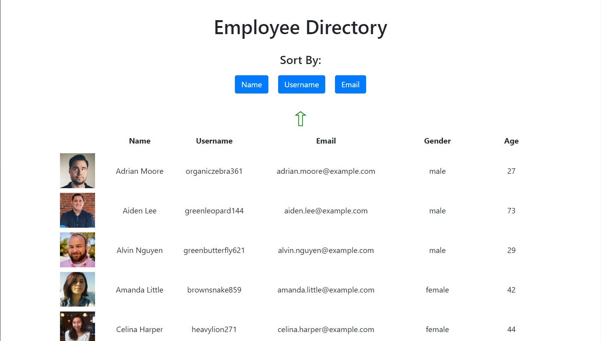

# Employee Directory


## Description

The employee directory is a React app that uses the random user generator from [randomuser.me](https://randomuser.me/) to generate a table of 40 random users along with their associated information. You can filter the table alphabetically by 3 categories: name, email, and username. The table can then displayed in reverse order by clicking a generated arrow button.

### _Visit this website by clicking the link below_
[Employee Directory](https://tniles320.github.io/employee-directory/)



## Table of Contents 

* [Installation](#installation)

* [License](#license)

* [Contribution Guidelines](#contribution-guidelines)

* [Tests](#tests)

* [Questions](#questions)

## Installation

Run the following command to install dependencies:

```
npm install
```

## License

This project is licensed under MIT

## Contribution Guidelines

Currently there are no contribution guidelines for this repo.

## Tests

Run the following command in the terminal to run tests:

```
no tests currently for this repo
```

## Questions

If you have any questions regarding this repo, you may contact me at tniles320@gmail.com. To see my other work, follow this link: [GitHub](https://github.com/tniles320/).